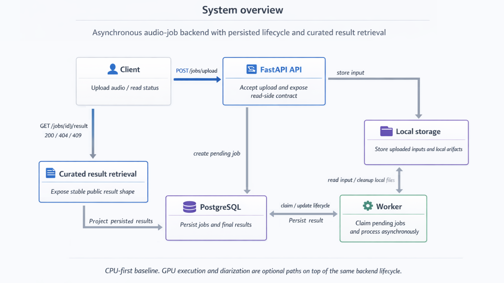

# speech-jobs-backend

Asynchronous audio-job backend for transcription with optional speaker diarization.

## Executive summary

`speech-jobs-backend` is a backend-first portfolio project built around a small but realistic asynchronous processing flow: upload audio, persist a job, process it in a dedicated worker, and retrieve a curated public result.

The repository focuses on architecture clarity, persistence-backed lifecycle management, reproducible local setup, and technically defensible scope control. It is designed to be easy to evaluate in an interview setting and practical to run locally.

The current baseline is CPU-first and local-first. GPU execution and diarization are supported as optional paths when the required runtime and model access are available.

## What this repo demonstrates

- Asynchronous job handling with a dedicated worker instead of in-request processing.
- PostgreSQL-backed lifecycle and result persistence, versioned through Alembic migrations.
- A small public API with explicit upload, job-status, and result-retrieval contracts.
- Curated result retrieval that exposes stable public fields instead of raw internal metadata.
- Runtime readiness checks through worker preflight.
- Controlled local reproducibility with `docker compose`, tests, and CI validation.

## Project status

- FastAPI API, PostgreSQL persistence, and a dedicated worker are implemented and runnable.
- The public API includes `POST /jobs/upload`, `GET /jobs/{id}`, and `GET /jobs/{id}/result`.
- Local setup is reproducible through a CPU-first `docker compose` flow.
- GPU execution and diarization remain optional runtime paths.
- Tests and CI cover the current backend baseline.

## Table of contents

- [5-minute quickstart](#5-minute-quickstart)
- [Architecture at a glance](#architecture-at-a-glance)
- [What this repo does not try to be](#what-this-repo-does-not-try-to-be)
- [Project structure](#project-structure)
- [Repository map / Where to read next](#repository-map--where-to-read-next)
- [Base runtime requirements](#base-runtime-requirements)
- [Optional GPU path](#optional-gpu-path)
- [Optional diarization-enabled path](#optional-diarization-enabled-path)
- [Minimal API example](#minimal-api-example)
- [Contributing](#contributing)
- [License / Third-party](#license--third-party)

## 5-minute quickstart

The main local path uses `docker compose` and the canonical example audio `examples/audio/monologue_james_6m20s.m4a`.

1. Copy the environment template.
2. Start PostgreSQL.
3. Apply database migrations.
4. Start the API and worker.
5. Optionally verify `GET /health`.
6. Upload one audio file.
7. Read job status.
8. Read the public result.

```bash
cp .env.example .env
docker compose up -d db
docker compose run --rm api alembic upgrade head
docker compose up -d api worker
```

Optional readiness checks:

- API health via `GET /health`:

```bash
curl http://127.0.0.1:8000/health
```

- Worker runtime readiness:

```bash
python -m app.worker.main --preflight
```

Upload one audio file with the public API:

```bash
curl -X POST http://127.0.0.1:8000/jobs/upload \
  -F "file=@examples/audio/monologue_james_6m20s.m4a" \
  -F "profile=balanced" \
  -F "device_preference=auto"
```

The upload response returns a job id. Use that value in the next requests:

```bash
curl http://127.0.0.1:8000/jobs/JOB_ID
curl http://127.0.0.1:8000/jobs/JOB_ID/result
```

Expected public-result behavior:

- `404` when the job does not exist
- `409` when the job exists but the result is not ready yet
- `200` when a persisted `JobResult` exists

## Architecture at a glance



| Area | Responsibility |
| --- | --- |
| API | Accept uploads and expose read-side job/result endpoints |
| PostgreSQL | Persist job lifecycle and final results |
| Worker | Claim pending jobs and run processing asynchronously |
| Local storage | Hold uploaded inputs and optional local artifacts |
| Alembic | Version and apply schema changes |
| CI | Validate migrations, tests, and app import |

For the full technical baseline, lifecycle, and design decisions, read [ARCHITECTURE.md](ARCHITECTURE.md).

## What this repo does not try to be

- An authentication or multi-user platform.
- A distributed queue or task-orchestration system.
- A cloud deployment template.
- A frontend application.
- A multi-tenant speech product with broad product surface area.

## Project structure

```text
.
|-- src/app/                # API, worker, persistence, and core app code
|-- tests/                  # API, worker, lifecycle, recovery, and contract tests
|-- alembic/                # Migration environment and versions
|-- examples/               # Example audio used for local validation and demos
|-- .github/workflows/      # CI workflow
|-- docker-compose.yml      # Local db/api/worker baseline
|-- README.md
|-- ARCHITECTURE.md
|-- CONTRIBUTING.md
```

## Repository map / Where to read next

- Read [ARCHITECTURE.md](ARCHITECTURE.md) for technical design, lifecycle, and system boundaries.
- Read [CONTRIBUTING.md](CONTRIBUTING.md) for safe change workflow and validation expectations.
- Expect future localized READMEs to document specific areas such as the worker, tests, examples, API package, and Alembic layer.

## Base runtime requirements

The supported baseline is CPU-first.

- Docker and Docker Compose for the main local path.
- PostgreSQL through the Compose flow shown above.
- `ffmpeg` / `ffprobe` available for audio validation and processing support.
- The project Python environment available when running the app or worker directly outside Compose.

`python -m app.worker.main --preflight` is a useful readiness signal, but it does not replace the baseline setup above.

## Optional GPU path

GPU execution is optional.

- Use it only when you want a GPU-accelerated runtime for supported processing paths.
- It depends on a compatible local runtime with CUDA and cuDNN available.
- Keep the CPU-first path as the default baseline for local reproducibility.

## Optional diarization-enabled path

Diarization is optional and has its own requirements.

- Set a valid `HUGGINGFACE_TOKEN`.
- Ensure the configured diarization model is accessible to that token/account.
- Treat diarization as an optional extension on top of the baseline transcription flow.

## Minimal API example

```bash
curl -X POST http://127.0.0.1:8000/jobs/upload \
  -F "file=@examples/audio/monologue_james_6m20s.m4a" \
  -F "profile=balanced" \
  -F "device_preference=auto"

curl http://127.0.0.1:8000/jobs/JOB_ID
curl http://127.0.0.1:8000/jobs/JOB_ID/result
```

Public result semantics stay simple:

- `404` when the job does not exist
- `409` when the result is not ready yet
- `200` when `JobResult` exists

## Contributing

See [CONTRIBUTING.md](CONTRIBUTING.md) for the full contribution workflow. As a baseline, keep changes small, verify the affected behavior, and avoid mixing unrelated edits.

## License / Third-party

The repository ships under MIT. Relevant third-party components, models, and demo-resource notes are centralized in `THIRD_PARTY.md`.
